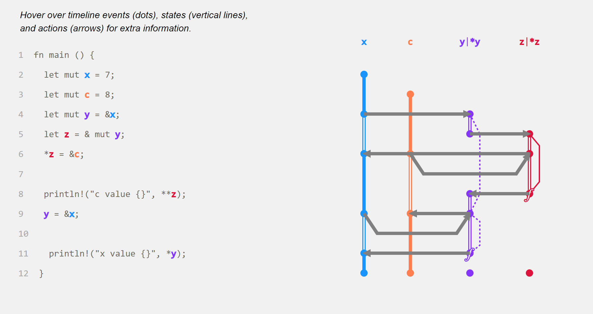

# RustViz

**RustViz** generates interactive timeline visualizations of ownership and
borrowing for short Rust programs. It is meant as a teaching aid: paste a
snippet and see exactly when each binding becomes the resource owner, when
references go in and out of scope, and which lines those events correspond
to.

This repository is now the compiler-integrated rewrite. Earlier
versions of RustViz, deployed in the classroom and described in [our VL/HCC 2022 paper](https://web.eecs.umich.edu/~comar/rustviz-vlhcc22.pdf), read hand-annotated source; this one plugs into `rustc`
directly and walks HIR/MIR, so the diagram reflects the real borrow
checker's view of the program rather than a hand-curated approximation.

> Looking for the original (annotation-based) RustViz? It lives on
> the [`rv1-final`](https://github.com/rustviz/rustviz/tree/rv1-final)
> branch and tag in this repo, with a matching
> [GitHub Release](https://github.com/rustviz/rustviz/releases/tag/rv1-final).

RustViz is a project of the [Future of Programming Lab](https://fplab.mplse.org/)
at the University of Michigan.

> **Try it live:** <https://rustviz.github.io/>



---

## Local setup

The CLI, mdbook preprocessor, and library all share a runtime
dependency on the rustc plugin built from this workspace, which links
against `rustc_private` and so requires a specific nightly toolchain.
The fastest way to get a working install is:

```sh
cargo install rustviz-cli   # the `rustviz` CLI binary
rustviz init                # installs nightly-2025-08-20 + the plugin
```

`rustviz init` runs the underlying `rustup toolchain install` + `cargo
install` against the canonical RustViz repo; pass `--dry-run` to see
exactly what it would do, or `--plugin-git` / `--plugin-rev` to install
from a fork. See `rustviz init --help` for the full flag list.

**Building from this checkout instead** (e.g. you're contributing):

```sh
git clone https://github.com/rustviz/rustviz
cd rustviz
./setup.sh                 # toolchain + plugin install + frontend build + runner image
```

`./setup.sh` is the canonical bootstrap for working *on* RustViz; it
sets up everything you need to run any of the four entry points below
plus the playground's React frontend. To undo it, run `./uninstall.sh`
(see `--help` for what it touches and what it leaves alone — by
default it spares the rustup toolchain and the cargo `target/` tree).

### Working from multiple checkouts in parallel

If you keep several clones around (e.g. one branch per agent or per
issue), they share `~/.cargo` by default — so `setup.sh`'s `cargo
install` from each one races for `~/.cargo/bin/rustviz`, and
concurrent playground builds collide on the `rustviz/rustviz-runner`
docker tag. To isolate them, this repo ships an
[`.envrc.example`](.envrc.example) for [direnv](https://direnv.net/)
that gives each checkout its own `CARGO_HOME` (and optional knobs
for the docker tag and playground bind address):

```sh
brew install direnv
echo 'eval "$(direnv hook zsh)"' >> ~/.zshrc   # then restart your shell
cp .envrc.example .envrc
direnv allow
```

After that, any shell — and anything it launches, including `claude`
— inherits a per-clone cargo home automatically when you `cd` into
the checkout. The rustup toolchain stays shared across clones since
they all pin the same nightly.

---

## Four ways to use RustViz

### 1. The playground

The hosted playground lets you paste a snippet into a CodeMirror editor and
get back the visualization with no local install. Available at
<https://rustviz.github.io/>; the SPA loads from GitHub Pages
and the compile API is on Fly.io. You can also run the same playground
locally — it's the [`playground/`](playground/) crate in this workspace.

See [`playground/README.md`](playground/README.md) for the local quick-start
and the operational notes for the production deploy.

### 2. The mdbook preprocessor

Embed RustViz visualizations directly in an [mdBook](https://rust-lang.github.io/mdBook/)
by tagging code blocks with ` ```rv ` instead of ` ```rust `. The
preprocessor compiles each snippet through the plugin at build time and
inlines the resulting SVGs into the rendered HTML, with tooltip glue for
hover-driven exploration.

```toml
# book.toml
[preprocessor.rustviz]
```

````markdown
```rv
fn main() {
    let s = String::from("hello");
    println!("{}", s);
}
```
````

See [`mdbook-rustviz/README.md`](mdbook-rustviz/README.md) for setup
instructions and `mdbook-rustviz/test-book/` for a small worked
example. The hands-on Rust tutorial at
<https://github.com/rustviz/tutorial> (deployed at
<https://rustviz.github.io/tutorial/>) is a full-scale example built
this way.

### 3. The command-line interface

For one-shot rendering of a single `.rs` file:

```sh
cargo install rustviz-cli       # the `rustviz` binary
rustviz init                    # one-time: install nightly + plugin

rustviz svg foo.rs              # writes foo.code.svg + foo.timeline.svg
rustviz html foo.rs             # writes one self-contained HTML page
```

`svg` is for embedding into your own HTML/Markdown workflow. `html`
produces a single self-contained file with both SVGs inlined and the
tooltip JS embedded — opens in any browser, no server, no external
assets. See `rustviz init --help` for the bootstrap flags.

### 4. The Rust library

For programmatic SVG generation (e.g. wiring RustViz into your own
authoring pipeline), `rustviz-lib` exposes a small Rust API:

```rust
use rustviz_lib::Rustviz;

let rv = Rustviz::new(code)?;     // calls the plugin under the hood
fs::write("code.svg", rv.code_panel_string())?;
fs::write("timeline.svg", rv.timeline_panel_string())?;
```

A runnable example lives at
[`rustviz-lib/examples/render_to_files.rs`](rustviz-lib/examples/render_to_files.rs).
The crate's [API docs](rustviz-lib/src/lib.rs) cover the backend split
(local subprocess vs. sandboxed Docker — `local` is the default for
library use; the playground binary opts into `docker` for untrusted
input).

---

## Repository layout

The workspace is organized around the four entry points above. Each
top-level directory:

| Path                  | Contents |
|-----------------------|----------|
| **`rustviz-plugin/`** | The rustc plugin — the heart of the project. Walks HIR/MIR for a single-file crate and emits a code-panel + timeline-panel SVG on stdout. Built on Will Crichton's `rustc_plugin` / `rustc_utils` crates (same family as Flowistry / Aquascope). Produces the `cargo-rv-plugin` and `rv-plugin-driver` binaries. Pinned to nightly-2025-08-20 via `rust-toolchain.toml`. Published to crates.io as **`rustviz-plugin`**. |
| **`rustviz-lib/`**    | User-facing Rust library. Exposes `Rustviz::new(code)` which shells out to the plugin and returns the two SVGs. The shared tooltip JS for hover behavior also lives here, exported as `rustviz_lib::HELPERS_JS`. Published to crates.io as **`rustviz-lib`**. |
| **`rustviz-cli/`**    | The `rustviz` command-line interface — `rustviz svg`, `rustviz html`, `rustviz init`. Wraps `rustviz-lib` with file I/O + self-contained-HTML output, plus a one-shot toolchain/plugin bootstrap (`init`). Published to crates.io as **`rustviz-cli`**. |
| **`mdbook-rustviz/`** | An [mdBook](https://rust-lang.github.io/mdBook/) preprocessor. Replaces ` ```rv ` fenced code blocks with embedded RustViz SVGs at build time. Includes a `test-book/` worked example. The full hands-on tutorial that uses it is in a [separate repo](https://github.com/rustviz/tutorial). Published to crates.io as **`mdbook-rustviz`**. |
| **`playground/`**     | The web playground: Actix-web backend + a Vite/React/CodeMirror frontend. Hosted at <https://rustviz.github.io/> with the compile API at <https://rustviz-playground.fly.dev/>. The same binary works as an all-in-one server for local dev. The per-request Docker sandbox image, deploy artifacts, and security threat model all live alongside it under `playground/`. Not published to crates.io. |
| `scripts/bump-version.sh` | Synchronizes the version field across all four published crates' Cargo.toml files (and refreshes Cargo.lock). Run before tagging a release; see "Releasing" below. |
| `setup.sh`            | One-shot dev bootstrap: installs the toolchain, builds the plugin, builds the frontend, builds the runner image. Run once after cloning. |
| `uninstall.sh`        | Reverse of `setup.sh`. Removes the cargo-installed binaries + the local docker runner image + frontend artifacts; spares the rustup toolchain and `target/` by default (override with `--toolchain` / `--target` / `--everything`). |

---

## Limitations

RustViz 2 is a research tool. It supports a meaningful subset of Rust but
not all of it. Currently unsupported (or known to misbehave):

- For-loops
- Bindings or borrows inside an `if` or `match` branch body (the
  conditional itself can return a value into a `let`, but tracking
  events inside the branch isn't supported)
- Closures — captures (whether by reference or by `move`) aren't
  drawn as arrows, so the visualization silently omits the capture
  event
- Smart-pointer wrappers (`Box`, `Rc`, `Arc`, `RefCell`) and trait
  objects (`Box<dyn T>`)
- Indexing or slicing collections like `Vec` (string slices like
  `&s[..]` on a `String` do work)
- The `?` operator (and other desugaring-heavy forms like
  `async`/`await`)
- Some struct field access patterns: chaining a method onto a field
  (`r.field.method()`), nested field access (`r.a.b`), and field
  access through a reference (`(&r).field`). Plain `r.field` and
  `&r.field` work.
- Inherent methods (`impl S { fn ... }`) are fragile — the
  Rectangle/area pattern (`fn area(&self) -> u32 { self.width *
  self.height }`) works, but minor variants (e.g. a one-field
  `fn get(&self) -> i32 { self.n }`) crash.

The plugin has a TODO list with more detail in
[`rustviz-plugin/README.md`](rustviz-plugin/README.md).

---

## Security

The playground compiles untrusted Rust source. Proc-macro expansion in user
code is arbitrary code execution, so the playground runs the plugin inside
a sandboxed container by default. The full threat model and operator
checklist are in [`playground/SECURITY.md`](playground/SECURITY.md). Report findings to
`comar@umich.edu`.

---

## Contributing

Issues and PRs welcome. Keep each PR focused on a single concern; for
local-dev setup run `./setup.sh` then `cargo build --workspace --locked`.

## Releasing

Four crates are published to crates.io in lockstep, all sharing the
same version:

| Crate                                                            | What it is |
|------------------------------------------------------------------|------------|
| [`rustviz-plugin`](https://crates.io/crates/rustviz-plugin)      | The rustc plugin (binaries `cargo-rv-plugin` + `rv-plugin-driver`). |
| [`rustviz-lib`](https://crates.io/crates/rustviz-lib)            | Rust library: `Rustviz::new(code)` returns the SVGs. |
| [`rustviz-cli`](https://crates.io/crates/rustviz-cli)            | The `rustviz` CLI binary (`svg`, `html`, `init`). |
| [`mdbook-rustviz`](https://crates.io/crates/mdbook-rustviz)      | The mdBook preprocessor. |

Versions follow `v2.Y.0` (major fixed at 2 to match RustViz 2; patch
fixed at 0 since the four crates always release together — bumping Y
covers everything from a typo fix to a breaking API change). To cut a
release:

```sh
# 1. Bump versions on a branch, open a PR, get it reviewed + merged.
./scripts/bump-version.sh         # auto-increment Y
# (or: ./scripts/bump-version.sh 5  to set v2.5.0 explicitly)
git checkout -b release/v2.5.0
git add -A && git commit -m 'Bump RustViz to v2.5.0'
git push -u origin release/v2.5.0
gh pr create --fill                # land it on main

# 2. Once the bump PR is merged, tag the merge commit and push the tag.
#    Merging the PR does NOT auto-tag — tagging is a separate, deliberate
#    step so you have a clean "yes, ship this" checkpoint.
git checkout main && git pull
git tag v2.5.0
git push origin v2.5.0
```

The pushed `v2.Y.0` tag triggers
[`.github/workflows/publish.yml`](.github/workflows/publish.yml), which
verifies all four manifests pin the tag's version and then publishes
them in dependency order (`rustviz-plugin` and `rustviz-lib` first,
then `rustviz-cli` and `mdbook-rustviz`). A `CRATES_IO_TOKEN` repo
secret with `publish-new` + `publish-update` scope on those four crate
names is required.

## Credits

RustViz is a project of the
[Future of Programming Lab](https://web.eecs.umich.edu/~comar/) at the
University of Michigan. The plugin is built on
[`rustc_plugin`](https://github.com/cognitive-engineering-lab/rustc_plugin) /
[`rustc_utils`](https://github.com/cognitive-engineering-lab/rustc_plugin)
by [Will Crichton](https://willcrichton.net/), and ports several
MIR / borrow-fact helpers from
[Aquascope](https://github.com/cognitive-engineering-lab/aquascope)
(another visualization tool for Rust) by
[Gavin Gray](https://gavinleroy.com/).

## License

[MIT](LICENSE).

## Citing

If you use RustViz in academic work, please cite the
[VL/HCC 2022 paper](https://web.eecs.umich.edu/~comar/rustviz-vlhcc22.pdf).
