# Lifetime Annotation Manual
## Overview
Rustviz lifetime visualization feature creates interactive SVG on calculation of lifetime parameters in function signatures and struct methods. It consists of basic lifetime analysis from function signautre (under invocation) which generates inequalities for lifetime parameters under contern. Also, a concretizd variables' lifetimes graph will be generated which directly relates to their associated lifetime parameters. If multiple lifetime parameters is present in one function/method, it will group calculation for the same lifetime parameter and render visualization for all lifetime parameter in a unified way. For example, the following functions/methods can be visualized:
+ Lifetime parameters in function call:
```rust
fn max<'a,'b,'r> (lhs: &'a i32, rhs: &'b i32) -> &'r {...}
```
+ Lifetime parameters in struct static method:
```rust
struct Circle<'i>{
    r: &'i i32,
}

impl<'i> Circle<'i>{
    fn new(_r: &'i i32) -> Circle {...}
}

```
+ Lifetime parameters in struct non-static method:
```rust
struct Circle<'i>{
    r: &'i i32,
}

impl<'i> Circle<'i>{
    fn cmp(&'i self, other: &'i i32) -> &'i i32{...}
}
```
Resulting visualization may look like the followings:
+ Example of lifetime parameter in normal function:

+ Example of lifetime parameter in struct static method:
     
+ Example of lifetime parameter in struct non-static method:


***In order to view interactive version, it's recommended to run `view_examples.sh` in `rustviz_mdbook` directory and view in on `localhost:8000`, where hover messages will be enabled.***

## Framework for Creating New Visualization
In this section, we will steer you through creating a new visualization for lifetime parameter in a non-static method for struct `Circle`. First, we need to create a directory to hold all files, called `lifetime_circle`.
Directory framework is basically the same former Rustviz requirements.
```shell
lifetime_circle
├── input
│   └── annotated_source.rs
├── main.rs
├── source.rs
```
Let's explain what roles they play in generating a lifetime visualization:
+ `source.rs`: where your original code will go to. Make sure it contains one and only one `main` function and it should be as simple as possible, namely, no including of custom defined modules. Also, you, as a tutorial maker, should provide correct code. Since Rustviz is not a Rust compiler, it obeys what's dictated from you and generate visualization by annotations you make. Either incorrect code or incorrect annotation results in fallacious visualization. In our case, we define a simple struct to illustrate how lifetime parameter works in struct member method and invoke it in function `main`, which all go into `source.rs`:
```rust
// in source.rs
struct Circle<'i>{
    r: &'i i32,
}

fn main(){
    let r1 = 10;
    let r2 = 9;
    let c = Circle::new(&r1);
    let opt = c.cmp(&r2);
    println!("{} is larger", opt);
}

impl<'i> Circle<'i>{
    fn new(_r: &'i i32) -> Circle {
        Circle{r: _r}
    }
}

impl<'i> Circle<'i>{
    fn cmp(&'i self, other: &'i i32) -> &'i i32{
        if self.r > other{
            self.r
        }
        else{
            other
        }
    }
}
```
+ `main.rs`
+ `input/annotated_source.rs`
