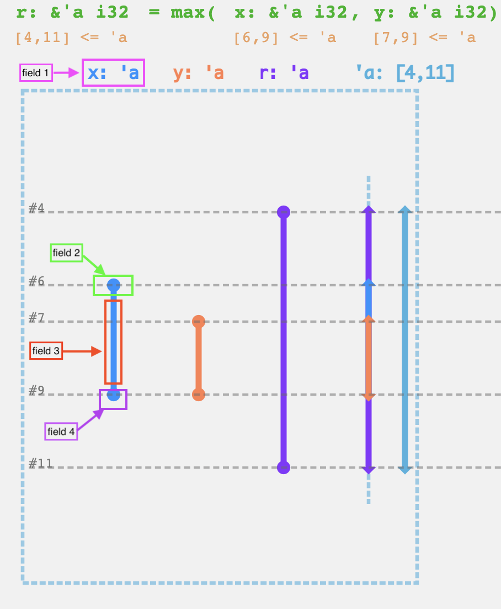

# Lifetime Annotation Manual

## Overview

Rustviz lifetime visualization feature creates interactive SVG on calculation of lifetime parameters in function signatures and struct methods. It consists of basic lifetime analysis from function signature (under invocation) which generates inequalities for lifetime parameters under concern. Also, a concretized variables' lifetimes graph will be generated which directly relates to their associated lifetime parameters. If multiple lifetime parameters are present in one function/method, calculations are grouped for the same lifetime parameter and render the visualization for all lifetime parameters in a unified way. For example, the following functions/methods can be visualized:

+ Lifetime parameters in function call:

```rust
fn max<'a,'b,'r> (lhs: &'a i32, rhs: &'b i32) -> &'r {...}
```

+ Lifetime parameters in struct static method:

```rust
struct Circle<'i>{
    r: &'i i32,
}

impl<'i> Circle<'i>{
    fn new(_r: &'i i32) -> Circle {...}
}

```

+ Lifetime parameters in struct non-static method:

```rust
struct Circle<'i>{
    r: &'i i32,
}

impl<'i> Circle<'i>{
    fn cmp(&'i self, other: &'i i32) -> &'i i32{...}
}
```

Resulting visualization may look like the followings:

+ Example of lifetime parameter in normal function:



+ Example of lifetime parameter in struct static method:



+ Example of lifetime parameter in struct non-static method:



***In order to view interactive version, it's recommended to run `view_examples.sh` in `rustviz_mdbook` directory and view in on `localhost:8000`, where hover messages will be enabled.***

## Framework for Creating New Visualization

In this section, we will steer you through creating a new visualization for lifetime parameter in a non-static method for struct `Circle`. First, we need to create a directory to hold all files, called [`lifetime_circle`](../src/examples/lifetime_circle/), inside [`src/examples`](../src/examples/).
Directory framework is basically the same former Rustviz requirements.

```shell
lifetime_circle
├── input
│   └── annotated_source.rs
├── main.rs
├── source.rs
```

Let's explain what roles they play in generating a lifetime visualization.

### `lifetime_circle/source.rs`

 This is where your original code will go to. Make sure it contains one and only one `main` function and it should be as simple as possible, namely, no including of custom defined modules. Also, you, as a tutorial maker, should provide correct code. Since Rustviz is not a Rust compiler, it obeys what's dictated by you and generates visualizations by annotations you make. Either incorrect code or incorrect annotation can result in a fallacious visualization. In our case, we define a simple struct to illustrate how lifetime parameter works in struct member method and invoke it in function `main`, which all go into `source.rs`:

```rust
// in source.rs
struct Circle<'i>{
    r: &'i i32,
}

1 fn main(){
2    let r1 = 10;
3    let r2 = 9;
4    let c = Circle::new(&r1);
5    let opt = c.cmp(&r2);
6    println!("{} is larger", opt);
7 }

impl<'i> Circle<'i>{
    fn new(_r: &'i i32) -> Circle {
        Circle{r: _r}
    }
}

impl<'i> Circle<'i>{
    fn cmp(&'i self, other: &'i i32) -> &'i i32{
        if self.r > other{
            self.r
        }
        else{
            other
        }
    }
}
```

### `lifetime_circle/main.rs`:

 `main.rs` is the major file for you to provide proper annotations for Rustviz to generate SVG visualizations. To note, there can be  lifetime visualization for **only one** function call. That's to say, we cannot generate visualization for both `Circle::new` and `Circle::cmp` in one `main.rs`. To do so, you need to create a separate directory and repeat the same structure. In our case, we just want to visualize `Circle::cmp` invoked on line 7.

 Next step is to inform Rustviz what variables it need to take into account, which also inherit legacy Rustviz implementation. At the beginning of `main.rs`, add the header along with variables names:

```rust
 /∗ --- BEGIN Variable Definitions ---
LifetimeVars opt; LifetimeVars c; LifetimeVars &r2;
--- END Variable Definitions --- ∗/
```

There are several points to note:

1. Unlike former Rustviz variable declaration, lifetime visualization has its own RAP (resource access point). For now there are only two kinds of RAP defined exclusively lifetime visualization:

   + `LifetimeVars`: variables that directly appear in the function signature one wants to visualize. This may include all input function parameters, function return variables and struct instance if this is not a static struct method.
   + `LifetimeBind`: variables that contribute to the calculation of a lifetime parameter whose contribution is not immediately obvious from function signature. For example, in the case a container of references is passed as a parameter to the function, similar to the following,

   ```rust
   // suppose this is the function we want to visualize
   fn process_vec<'i>(queue: &'i Vec<&'i u32>) -> &'i u32 {...}

   fn main(){
        let a : u32 = 10;
        let b : u32 = 15;
        let mut q : Vec<&u32> = Vec::new();
        q.push(&a);
        q.push(&b);
        // the invocation for the function we want to visualize
        ret = process_vec(&q);
   }
   ```
   One might consider objects contained in `queue`, such as `a` and `b`, for calculation of `'i`.

In our example, our goal is to calculate lifetime parameter `'i` by invocation on line 5. Therefore, we need to take care of:

+ `opt`: returned variable (reference) by `Circle::cmp`, should be annotated with `LifetimeVars`.
+ `c`: struct instance of `Circle` which calls method `cmp`, should be annotated with `LifetimeVars`.
+ `&r2`: input variable for `Circle::cmp`, should be annotated with `LifetimeVars`. Note that the ampersand shouldn't be elided, since we're passing a reference rather than an owner object.

Apart from declaring RAPs at the beginning of `main.rs`, we also need to tell which exact function call we're targeting. The reason is simple - there may be multiple invocations of the same function but with different passed variables. We specify the exact function call by adding the lifetime annotation immediately after the call, required on the same line:

```rust
fn main(){
    let r1 = 10;
    let r2 = 9;
    let c = Circle::new(&r1);
    let opt = c.cmp(&r2); // !{ Lifetime(<STRUCT: Circle::cmp>[c{11:14}][&r2{12:12}]->[opt{12:13}])}
    println!("{} is larger", opt);
}
```

`!{ Lifetime(<STRUCT: Circle::cmp>[c{11:14}][&r2{12:12}]->[opt{12:13}])}` is our lifetime annotation, which will be covered in the next section.

### Components of lifetime annotation

Basic framework of lifetime annotation can be abstract as the following:

```rust
// !{ Lifetime( <TYPE: func_name> [var1{start1, end1}*NAME* optional *CRPT* optional *BODY* optional *DRPT* optional] [var2...]...->[out1...][out...]... )}
```

+ Wrapper `!{Lifetime( ... )}`: the body of lifetime annotation should be a rust comment wrapped around by `!{Lifetime( ... )}`.
+ Function/Method name `<TYPE: func_name>`, where `TYPE = {FUNC|STRUCT}`:
  + If it's a function not a method, then use `<FUNC: func_name`. For example, `<FUNC: foo>`.
  + If it's a struct method, then you need to provide struct name as well, connected by double colons: `<STRUCT: struct_name::method_name`. For example, `<STRUCT: MyStruct::bar>`.
+ Variable lifetime information `[var{s,e} *NAME* optional *CRPT* optional *DRPT* optional *BODY* optional]`:
  + Every variable info should be wrapped around a pair of square bracket `[...]`.
  + You need to specify the variable name and lifetime start/end line number first. For example, `x: &i32` lives from line 6 to line 9 should be annotated with `[x{6:9}]`.
  + If you want to provide additional messages about the variable, you can fill up four optional fields (you don't need the curly bracket). It will appears as the hover message at particular places, illustrated in the below figure. The available tag to specify hover messages are:

    + `*NAME* {you messages}`: this will appear as the hover message on field 1.
    + `*CRPT* {you messages}`: this will appear as the hover message on field 2.
    + `*BODY* {you messages}`: this will appear as the hover message on field 3.
    + `*DRPT* {you messages}`: this will appear as the hover message on field 4.

    > Note that these four specifiers are *optional*. Rustviz will generate default hover messages at the label, creation point, lifetime body and drop point.


*hover message fields*

+ Output variable specifier `->`: everything following `->` will be treated as lifetime information of output variables from the function you want to visualize.

Now lets look back to our example annotation:

```rust
fn main(){
    let r1 = 10;
    let r2 = 9;
    let c = Circle::new(&r1);
    let opt = c.cmp(&r2); // !{ Lifetime(<STRUCT: Circle::cmp>[c{11:14}][&r2{12:12}]->[opt{12:13}])}
    println!("{} is larger", opt);
}
```

+ Since `cmp` is a struct method, in angle bracket field, we need to specify struct name and method name: `<STRUCT: Circle::cmp>`.
+ Variables' lifetime information:

  + For input variables, there're `c` living from line 11 to line 14, `&r2` living just on line 12 since it's temporal reference. Hence we place it one the left hand side of `->`.
  + For output variable, there is only `opt` living from line 12 to line 13 since reference's lifetime ends after its last use.
  + Hence, there are three variables, two inputs, one output: `[c{11:14}][&r2{12:12}]->[opt{12:13}]`

  > Note that line number should be the same in `source.rs`, not `main.rs`. Since `main.rs` contains additional header comments that shift line number.
  
  > Also, the lifetime annotation must be on the line in which the function/struct method is called.

Combining those into our lifetime annotation wrapper `!{Lifetime(...)}` we thus get our final result.

### `lifetime_circle/input/annotated_source.rs`

It's enough for the content of this file to be the same as `source.rs`, for most users. We're trying to auto generate this file in the future.

### Support for multiple lifetime visualization in one function call
Rustviz will parse the associated lifetime parameter with the variables. For example, if you have function `foo`:
```rust
fn foo<'a,'b>(x: &'a u32, y: &'b u32)
```
and you invoke this function:
```rust
foo(x1,y1);
```
Rustviz will know the lifetime parameter for  `x1` is `'a` and for `x2` is `'b`. See a sample visualization for multiple lifetime parameters in [`/src/examples/lifetime_db`](../src/examples/lifetime_db/main.rs)
## Conclusion

Hooray! By now you should be able to generate your own visualization on lifetime parameters. Try out your own creative example!
